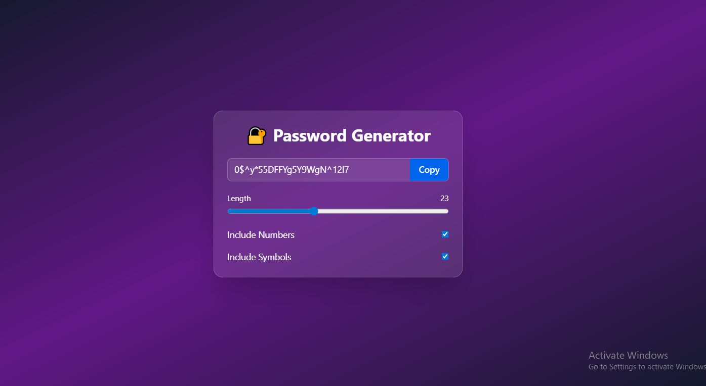

# 🔐 Password Generator (React + Tailwind CSS)

A modern and responsive password generator built using React. It allows users to generate secure passwords with customizable options like length, numbers, and special characters.

## 📸 Project Preview

---

## ✨ Features

- 🎚️ Adjustable password length (6–50)
- 🔢 Include numbers toggle
- 🔣 Include special characters toggle
- 📋 One-click copy to clipboard
- ⚡ Auto-generate password on settings change
- 🎨 Modern UI with Tailwind CSS

## ⚙️ How It Works

1. User selects password length using slider  
2. User enables/disables numbers and symbols  
3. App generates a random password dynamically  
4. User can copy password with one click  
5. Password updates automatically when settings change  

---

## 🧠 React Concepts Used

- useState → state management  
- useCallback → function optimization  
- useEffect → auto generation  
- useRef → DOM access (copy feature)  

---

## 🖥️ Setup & Installation

Clone the repository:

git clone https://github.com/Usama112222/React-Password-Generator
Install dependencies:
npm install
Run the project:
npm run dev

## 📋 Future Improvements

Add password strength meter 🔥

Add dark/light theme toggle 🌗

Add password history feature 📜

Improve animations and UI polish ✨

## 👨‍💻 Author
## Usama Liaqat
## GitHub: https://github.com/Usama112222

